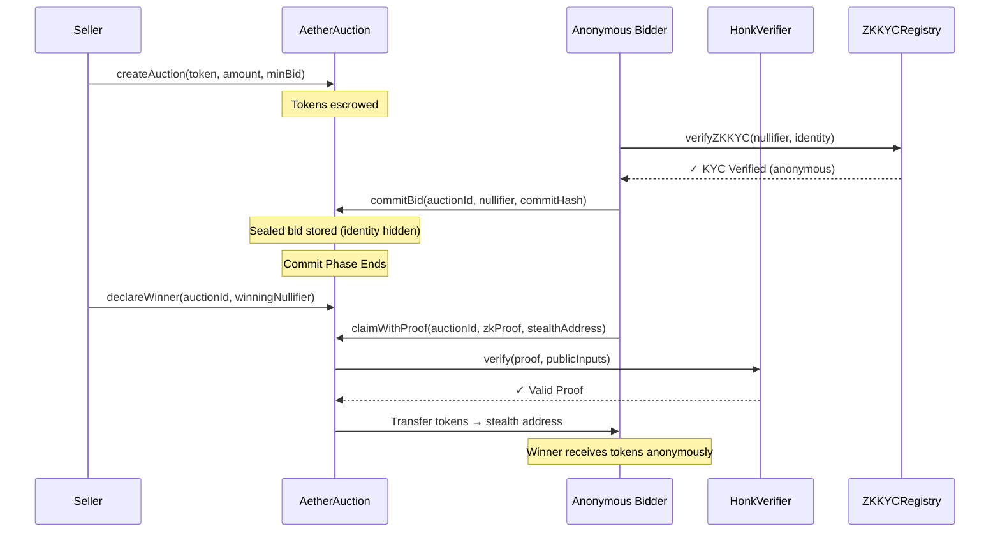

# Aether HSK — ZK-Private Auction Protocol

> **HashKey Chain On-Chain Horizon Hackathon** | ZKID Track

[](https://hashkeychain.net)
[](https://soliditylang.org)
[](./LICENCE)

## Overview

**Aether HSK** is a **ZK-powered sealed-bid auction protocol** deployed natively on **HashKey Chain Testnet**. It combines zero-knowledge proofs with privacy-preserving identity verification to enable **compliant yet anonymous** DeFi auctions — a first for the HashKey Chain ecosystem.

### Why ZKID Track?

The ZKID track focuses on *"proving without leaking"* — and that's exactly what Aether HSK does:

| Feature | How It Uses ZK |
|---------|---------------|
| **Anonymous Bidding** | ZK nullifiers allow users to bid without revealing their wallet address |
| **Stealth Delivery** | Auction tokens are sent to stealth addresses, hiding the winner's identity |
| **ZK-KYC Compliance** | Users prove KYC status via zero-knowledge proofs without exposing personal data |
| **Double-Bid Prevention** | Nullifiers prevent repeat bidding while maintaining anonymity |

### The Compliance-Privacy Balance

HashKey Chain is the *"preferred blockchain for financial institutions."* Aether HSK solves the fundamental tension between **regulatory compliance** and **user privacy** by introducing a **ZK-KYC layer** — users can prove they're KYC-verified without revealing *who* they are.

## Architecture

```
┌──────────────────────────────────────────────────────────┐
│                  Aether HSK Frontend                    │
│            (Next.js + RainbowKit + wagmi)                │
│  ┌─────────────┐  ┌──────────────┐  ┌─────────────────┐ │
│  │ Auction UI  │  │ ZK Proof Gen │  │ Stealth Address │ │
│  │ Dashboard   │  │ (Noir/WASM)  │  │ Manager         │ │
│  └─────────────┘  └──────────────┘  └─────────────────┘ │
└──────────────────────────┬───────────────────────────────┘
                           │
              ┌────────────┴────────────┐
              │   HashKey Chain Testnet  │
              │   RPC: testnet.hsk.xyz  │
              │   Chain ID: 133         │
              │                         │
              │  ┌───────────────────┐  │
              │  │ AetherAuction   │──┼── Sealed-bid auctions + stealth delivery
              │  └───────────────────┘  │
              │  ┌───────────────────┐  │
              │  │ HonkVerifier      │──┼── On-chain ZK proof verification
              │  │ (Aztec Noir)      │  │   (Honk/UltraPlonk)
              │  └───────────────────┘  │
              │  ┌───────────────────┐  │
              │  │ AetherToken     │──┼── ERC20 auction token (AETH)
              │  └───────────────────┘  │
              │  ┌───────────────────┐  │
              │  │ ZKKYCRegistry     │──┼── Privacy-preserving KYC attestations
              │  │ (NEW)             │  │   (HashKey Chain native)
              │  └───────────────────┘  │
              └─────────────────────────┘
```

## Smart Contracts

### AetherAuction.sol
The core auction engine with ZK-enhanced privacy:
- **Commit Phase**: Bidders submit sealed bids using ZK nullifiers (anonymous)
- **Declare Winner**: Owner reveals winning nullifier off-chain
- **Claim Phase**: Winner proves ownership via ZK proof, receives tokens to stealth address
- **ZK-KYC Gate**: Optional KYC verification before auction participation

### ZKKYCRegistry.sol *(New — HashKey Chain Native)*
Privacy-preserving KYC attestation registry:
- **Poseidon Hash Commitments**: Identity data stored as hashed commitments
- **Multi-Level KYC**: BASIC → ENHANCED → INSTITUTIONAL tiers
- **Nullifier-Based Verification**: Prove KYC status without revealing identity
- **Issuer Management**: Authorized KYC providers (e.g., HashKey KYC tools)
- **Time-Bounded Attestations**: Automatic expiration for regulatory compliance

### HonkVerifier.sol (NullifierVerifier)
On-chain ZK proof verifier built with Aztec's Noir framework:
- **UltraHonk Protocol**: Efficient proof verification on EVM
- **BN254 Pairing**: Compatible with HashKey Chain's OP Stack precompiles
- **~2400 lines** of optimized verification logic

### AetherToken.sol
Standard ERC20 token used for auction items.

## Auction Flow



## Tech Stack

| Layer | Technology |
|-------|-----------|
| **Smart Contracts** | Solidity ^0.8.19, Foundry |
| **ZK Proofs** | Aztec Noir, UltraHonk, BN254 |
| **Frontend** | Next.js, TypeScript, wagmi, RainbowKit |
| **Blockchain** | HashKey Chain Testnet (OP Stack L2) |
| **Dependencies** | OpenZeppelin Contracts |

## Network Configuration

| Parameter | Value |
|-----------|-------|
| Network | HashKey Chain Testnet |
| Chain ID | 133 |
| RPC URL | `https://testnet.hsk.xyz` |
| Explorer | `https://testnet-explorer.hsk.xyz` |
| Native Token | HSK |
| Gas Token | HSK |

## Deployed Contracts (HashKey Testnet 133)

| Contract | Address |
|----------|---------|
| AetherToken | `0x95193fa5fecd658293c3A1aac67b0E479b7C253a` |
| ZKKYCRegistry | `0x21b310EFC2599abaFFBa0af1c32C96AF68799621` |
| MockHonkVerifier | `0x4e771685c28ab47f4763809d63c7699709b06eb5` |
| AetherAuction | `0x3ebb3d5EeF6daeD210A0183a616A9D868Bb0983d` |

## Quick Start

### Prerequisites
- [Node.js](https://nodejs.org/) (≥ v20.18.3)
- [Foundry](https://book.getfoundry.sh/getting-started/installation)
- [Git](https://git-scm.com/downloads)
- HSK testnet tokens (from [Faucet](https://docs.hashkeychain.net/docs/Build-on-HashKey-Chain/Tools/Faucet))

### Setup

```bash
# Clone the repo
git clone https://github.com/prasadv06/Aether.git
cd Aether

# Install dependencies
yarn install

# Configure environment
cp packages/foundry/.env.example packages/foundry/.env
# Add your private key to .env
```

### Deploy to HashKey Chain Testnet

```bash
# Build contracts
cd packages/foundry
forge build

# Deploy
forge script script/Deploy.s.sol --rpc-url https://testnet.hsk.xyz --chain-id 133 --broadcast --verify

# Run tests
forge test -v
```

### Start Frontend

```bash
yarn start
# Visit http://localhost:3000
```

## HashKey Chain Integration Points

1. **Native HSK Gas**: All transactions use HSK as gas token
2. **KYC Tools**: ZKKYCRegistry designed to integrate with HashKey's KYC infrastructure
3. **Blockscout Explorer**: Contract verification on HashKey testnet explorer
4. **OP Stack Compatibility**: Full EVM compatibility including BN254 precompiles for ZK verification

## Project Structure

```
packages/
├── foundry/
│   ├── contracts/
│   │   ├── AetherAuction.sol    # Core auction (ZK + stealth)
│   │   ├── AetherToken.sol      # ERC20 token
│   │   ├── NullifierVerifier.sol  # Honk ZK verifier
│   │   └── ZKKYCRegistry.sol      # ZK-KYC (NEW)
│   ├── circuits/
│   │   └── nullifier_claim/       # Noir ZK circuits
│   ├── script/                    # Deploy scripts
│   └── test/                      # Foundry tests
└── nextjs/
    ├── app/                       # Next.js pages
    ├── components/aether/       # Auction UI components
    ├── contracts/                 # Deployed contract ABIs
    └── scaffold.config.ts         # HashKey Chain config
```

## Judging Criteria Alignment

| Criteria | How We Meet It |
|----------|---------------|
| **Built on HashKey Chain** | ✅ Deployed to HashKey Chain Testnet (chain ID 133) |
| **ZKID Track** | ✅ ZK nullifiers, stealth addresses, ZK-KYC registry |
| **Innovation** | ✅ First compliance-aware privacy auction on HashKey Chain |
| **Completeness** | ✅ Smart contracts + frontend + tests + deployment |
| **Technical Maturity** | ✅ Aztec Noir ZK circuits, on-chain Honk verifier |

## License

MIT License — see [LICENCE](./LICENCE)

---

*Built with ❤️ for the HashKey Chain On-Chain Horizon Hackathon*